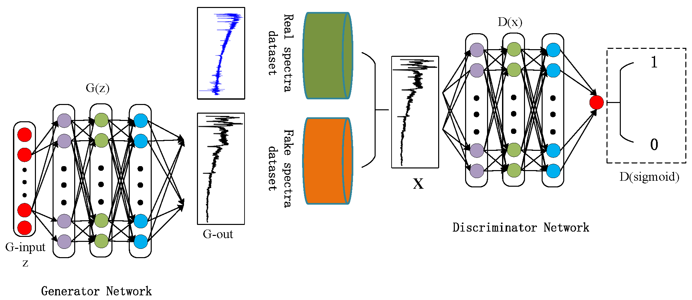

# StellarGAN: Classifying Stellar Spectra with Generative Networks in SDSS and APOGEE Sky Surveys

  
    Figure 1

Figure 1. The structure schematic of stellarGAN in the pre-training phase. The noise vector is fed into G to generate spectra, which are labeled as 0 to indicate that they are not from real data. Then the generated spectra and real spectra (labeled as 1) are sent to train the D.

